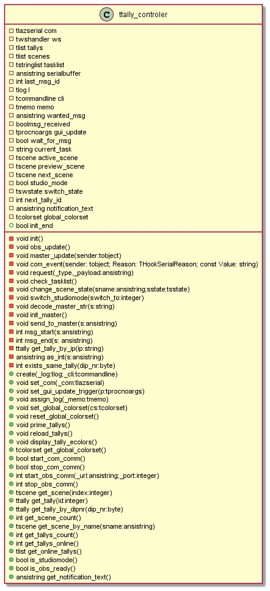

<https://LiaScript.github.io/course/?https://github.com/EliasTechnik/EnglishPresentation/blob/main/imagebug.md>

# Bug: image does not load with underscore in Filename

## Bug

The following image has one underscore in the alt-text, one in the path and one in the filename.

It seams like the first underscore in the alt-text is interpreted. Therefor the next underscore in the path is interpreted too and the text between the two underscores is displayed italic.  

## The same picture with the underscore in the alt-text removed

