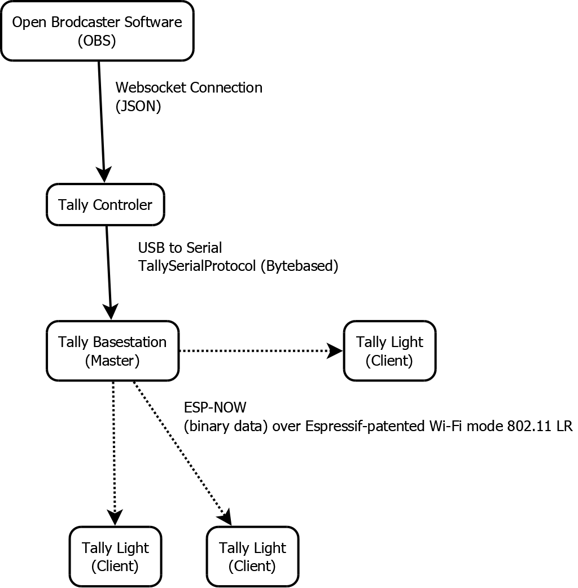
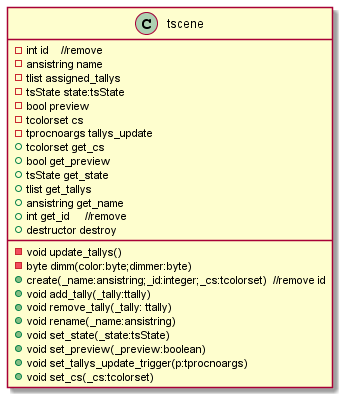
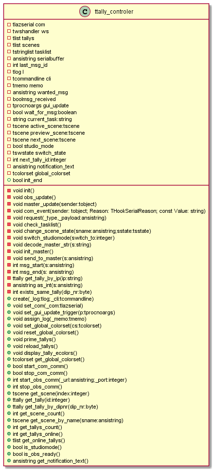

https://LiaScript.github.io/course/?https://github.com/EliasTechnik/EnglishPresentation/blob/main/readme.md

# Introduction: Project LRTallyLights

A short presentation of a side project that I have been working on since December 2020.

## Background  and Motivation

Since the first lockdown in 2020 the need for live streams has gone up. The church in my hometown searched some people with enough technical confidence to do it. Because it was interesting and I head enough time to do it, I joined the team.

During the lockdown we streamed every Sunday until summer. After that we streamed on special occasions like the Christmas or at easter. In that time, we learned a lot and got more professional, and the team did grow.

With a growing Team we were able to use more perspectives. Every non static camera needs an camera operator which is responsible to react on things in front of the camera.
We used an intercom to communicate between the director (he switches between cameras and does quality control) and the camera operators but that was not very reliable. So, I looked what bigger productions do. They use tally lights.

Tally Lights are, mostly red and green, lights which are mounted on each camera. They signal the camera operator if he is live or not. They also let the person in front of the camera know in which camera they should talk.

We used the Open Broadcaster Software (OBS) to stream so we needed a cheap tally system which could be used with OBS. At the time I started working on a solution there was not any system available that suited our needs.

## Parts of the Project

I thought about the project and how I can accomplish all the features in a practicable manner. For convenience I wanted to do the solution to be wireless but also without the hassle to connect to an existing network. The solution I came up with looks like that:

### Client (TallyLight)

The actual lights consist of 6 addressable LEDs, five dipswitches and a ESP32 development board. The power is feed through USB. Ether from an power bank or a USB charger.

In the moment, everything is housed in a cheap, self-crafted housing but I plan on creating a 3d-printed version of it. The tally has an antenna to improve the Wi-Fi-range and uses the flash-socket of the camera to mount on.

### Master (Base station)

Because the 802.11 LR mode is specific for the ESP32 the master must be an ESP32 to. It must be connected to an USB port at the pc which is running the control software. The clients connect on its own with the master and the master routes the relevant information to each client. It should also detect the system health (like Clients which are offline or data inconsistencies).

### Controller

The Controller fulfils 3 roles. It connects with OBS and parses the necessary data for the system. It also communicates with the master to edit the colours of the Tally lights. As the brain of the system, it also provides a graphical user interface to configure the system, assign Tallys to the corresponding scenes and let the user customize the colours and light intensity.
That feature is important because the System must be useful in the sunny morning and in the dark church without distracting the audience or the camera operator. The Controller must work also reliable because it runs on the same system which is running the live stream. Technically it can be run from any Device within the same network but for the better response time it should be run on the live system.

The Controller is programmed in Object Pascal with the Lazarus IDE. Therefor its mostly object-oriented designed and driven by events. The latest stable build of the controller is version 2.1, which I am going to show you. It has the most important features implemented and working plus some additional quality of life things. (It was also used in 3 different streams where I discovered more problems related to the reliability of the system and had the opportunity to hear other opinions and experiences. )-->maybe remove...

The heavy lifting is done mostly by three classes: ttally, tscene and ttally_controler. (Yes I noticed the incorrect spelling of Controller. But to keep things consistent and because its hard to change it in the implementation I stick to it. :-/)

As you can see the ttally_controler class is equipped with a variety of functions. <-- Add more here --> In the version 3.0, which I am currently working on, the ttally_controler gets reduced to its main functionality and the communication with the master gets outsourced. We will be concentrating on the init() procedure. (Pascal uses the word "procedure" in place of "void").

## Code Snippet

The init() procedure is called multiple times after the WebSocket connection with OBS is established. It gets the scene names, the current mode of OBS (normal or studio), the currently active (live) scene and, if the studio mode is used, the scene which is currently in the preview. To do so it sends multiple request to OBS and decodes the returning JSON data. To prevent init() to block the program while it waits for OBS to respond (that would make the UI non responsive for that timeframe) the procedure registers the next task -should OBS answer- into an task list.

The task list is like an internal to-do list. The procedure check_tasklist() starts the function associated with the first task in the list and sets it as currenttask.

### tallycontroler.init()

init() reads the variable currenttask and decodes the response from OBS. For parsing the JSON I use then jsontools library (<https://github.com/sysrpl/JsonTools>). It is simple to use: I create a tjsonnode (j:=tjsonnode.create;) and let it parse the received message. If that succeeds I use j.Find('\<keyword\>') to get the value of that field.

Note that the order of requests matter. First, I have to find out in which mode OBS currently runs. After that I must get a list of all scenes. The corresponding request also delivers the current output scene. After I have all the scenes created as objects and initialized, I can request the preview scene, if the OBS runs the studio mode. The pointer of the current and the preview scene are stored in extra variables for quick access.

The l.print() is a function of the tlog object. The controller is equipped with an log window which I used for debugging. I show this later in the demo.

.PNG)

### demonstration of OBS connection

--Show how it connects and that the information is correct
--Show the log
--Show some scene switching

## Conclusion of the Project

For now, there are more Tally Light solutions for OBS then it was at the start of the project but nothing similar to my solution. I am happy that the essential of the system work reliable enough to be tested in production. In the moment I redesign the serial communication between the Controller and the Master because I wasn't happy about the solution and the protocol design. As the project grows, I extended the tlog library with a command line and autocompletion. Therefore, debugging gets way easier because now I can trigger and test specific functions on its own without resetting the program or add extra elements to the UI.  

### Further improvements / ToDo's

The project does not end there. Like I mentioned before, I want to add some more features and change specific things:
    -rewrite the Master firmware for better reliance and performance
    -implement ping feature and measure response time
    -dim the light of each tally individualy
    -upgrade the Tally Lights with a button to signal the director that the camera operator is ready to go live
    -update the TallyProtocol to transmit the pushbutton signal
    -design a proper housing for the lights which is easy to assemble
    -fix rendering issues in darkmode
    -add signal and connection diagnosis to the tally system.
    -fix autocompletion bug on command line (sometimes it keeps suggesting a command not matching the user’s input)
    -remove deprecated functions and variables
