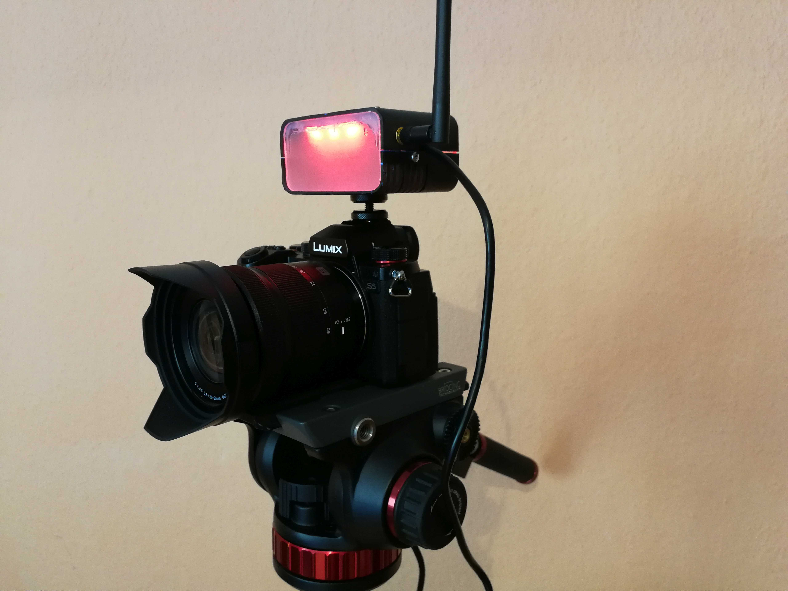

<https://LiaScript.github.io/course/?https://github.com/EliasTechnik/EnglishPresentation/blob/main/readme.md>

# Project LRTallyLights

A side project that I have been working on since December 2020.

## Background and Motivation

Since the first lockdown in 2020 the need for live streams has gone up. The church in my hometown searched some people with enough technical confidence to do it. Because it was interesting and I head enough time to do it, I joined the team. As the streams got bigger we needed more coordination between the camera operator and the director.

Additional to an intercom __Tally Lights__ where needed.
Tally Lights are, mostly red and green, lights which are mounted on each camera. They signal the camera operator if he is live or not. They also let the person in front of the camera know in which camera they should talk.

As we use the __Open Broadcaster Software (OBS)__ to stream, we needed a cheap tally system which could be used with OBS.

## Parts of the Project

I thought about the project and how I can accomplish all the features in a practicable manner. For convenience I wanted the solution to be wireless to but also without the hassle to connect to an existing network. The solution I came up with looks like that:


### Client (TallyLight)

The actual lights consist of 6 addressable LEDs, five dipswitches and a ESP32 development board. The power is feed through USB. Ether from an power bank or a USB charger.


In the moment, everything is housed in a cheap, self-crafted housing but I plan on creating a 3d-printed version of it. The tally has an antenna to improve the Wi-Fi-range and uses the flash-socket of the camera to mount on.

### Master (Base station)

Because the 802.11 LR mode is specific for the ESP32 the master must be an ESP32 to. It must be connected to an USB port at the pc which is running the control software. The clients connect on its own with the master and the master routes the relevant information to each client. It should also detect the system health (like Clients which are offline or data inconsistencies).


### Controller

The Controller fulfils 3 roles. It connects with OBS and parses the necessary data for the system. It also communicates with the master to edit the colours of the Tally lights. As the brain of the system, it also provides a graphical user interface to configure the system, assign Tallys to the corresponding scenes and let the user customize the colours and light intensity.


The Controller is programmed in Object Pascal with the Lazarus IDE. Therefor its mostly object-oriented designed and driven by events.
The heavy lifting is done mostly by three classes: `ttally`, `tscene` and `ttally_controler`. (Yes I noticed the incorrect spelling of Controller. But to keep things consistent and because its hard to change it in the implementation, I stick to it. :-/)


As you can see the `ttally_controler` class is equipped with a variety of functions. Thats not ideal but works for now. We will be concentrating on the `init()` procedure. (Pascal uses the word "procedure" in place of "void").

## Code Snippet

The `init()` procedure is called multiple times after the WebSocket connection with OBS is established. It gets the scene names, the current mode of OBS (normal or studio), the currently active (live) scene and, if the studio mode is used, the scene which is currently in the preview. To do so it sends multiple request to OBS and decodes the returning JSON data. 

To prevent `init()` to block the program while it waits for OBS to respond (that would make the UI non responsive for that timeframe) the procedure registers the next task (if OBS answers with correct information) into an task list.

The task list is like an internal to-do list. The procedure `check_tasklist()` starts the function associated with the first task in the list and sets it as `currenttask`.

```Delphi ttally_controler.init()
procedure ttally_controler.init;  //Init of the controller
var j,jarr:tjsonnode;
    s:tscene;
    i:integer;
    req_result:ansistring;
    current_scene:string;
begin
  case current_task of
  'none': begin
          l.print('INR: Request StudioModeStatus');
          init_end:=false;
          request('GetStudioModeStatus','');
          tasklist.Add('init_mode');
          end;
  'init_mode':begin
    l.print('INR: Got StudioModeStatus');
    j:=tjsonnode.create;
    if j.TryParse(wanted_msg) then begin
       studio_mode:=j.Find('studio-mode').AsBoolean;
    end;
    j.Destroy;
    l.print('INR: Request SceneList');
    request('GetSceneList','');
    end;
  'init_scenes': begin
            l.print('INR: Got SceneList');
            j:=tjsonnode.create;
            if j.TryParse(wanted_msg) then begin
               current_scene:=j.Find('current-scene').asstring;
               jarr:=j.Find('scenes').AsArray;
               for i:=0 to jarr.Count-1 do begin
                  s:=tscene.create(jarr.Child(i).Find('name').AsString,i,global_colorset);
                  s.set_tallys_update_trigger(@self.prime_tallys);
                  if s.get_name=current_scene then begin
                   s.set_state(sOn); //Maybe change
                   active_scene:=s;
                  end;
                  scenes.add(s) //todo
                end;
            end;
            j.Destroy;
            if studio_mode then begin
              tasklist.add('init_preview');
              l.print('INR: Request PreviewScene');
              request('GetPreviewScene','');
            end
            else begin
              init_end:=true;
              l.print('INR: Init End');
            end;
           end;
  'init_preview':begin
    l.print('INR: Got PreviewScene');
    j:=tjsonnode.create;
    if j.TryParse(wanted_msg) then begin
       preview_scene:=get_scene_by_name(j.Find('name').AsString);
       preview_scene.set_preview(true);
    end;
    j.Destroy;
    l.print('INR: Init End');
    init_end:=true;
    end;
  end;
  gui_update; //updates gui
end;
```

`init()` reads the variable `currenttask` and decodes the response from OBS. For parsing the JSON I use the jsontools library (<https://github.com/sysrpl/JsonTools >). It is simple to use: I create a `tjsonnode` (`j:=tjsonnode.create;`) and let it parse the received message. If that succeeds I use `j.Find('\<keyword\>')` to get the value of that field.

Note that the order of requests matters. First, I have to find out in which mode OBS currently runs. After that I must get a list of all scenes. The corresponding request also delivers the current output scene. After I have all the scenes created as objects and initialized, I can request the preview scene, if the OBS runs the studio mode. The pointer of the current and the preview scene are stored in extra variables for quick access.

The `l.print()` is a function of the `tlog` object. The controller is equipped with an log window which I use for debugging. The output from `init()` starts with `INR:` :


## Conclusion of the Project

For now, there are more Tally Light solutions for OBS available then it was at the start of the project but nothing similar to my solution. I am happy that the essential of the system work reliable enough to be tested in production.

The project isn't completed. In the moment I redesign the serial communication between the Controller and the Master because I wasn't particular happy about the protocol design and the solution in general.

*Side fact: As the project grows, I extended the `tlog` library with a command line and autocompletion. Therefore, debugging gets way easier because now I can trigger and test specific functions on its own without resetting the program or add extra elements to the UI. Maybe I convert `tlog` to an complete UI component which can be added to any Lazarus project.*  




### Further improvements / ToDo's

The project does not end there. Like I mentioned before, I want to add some more features and change specific things:

+ rewrite the Master firmware for better reliance and performance
+ implement ping feature and measure response time
+ dim the light of each tally individually
+ upgrade the Tally Lights with a button to signal the director that the camera operator is ready to go live
+ update the TallyProtocol to transmit the pushbutton signal
+ design a proper housing for the lights which is easy to assemble
+ fix rendering issues in darkmode
+ add signal and connection diagnosis to the tally system.
+ fix autocompletion bug on command line (sometimes it keeps suggesting a command not matching the user’s input)
+ remove deprecated functions and variables
